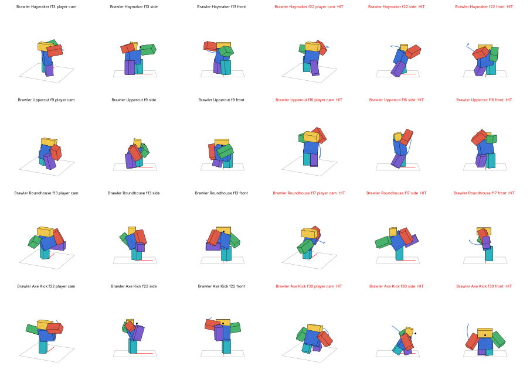
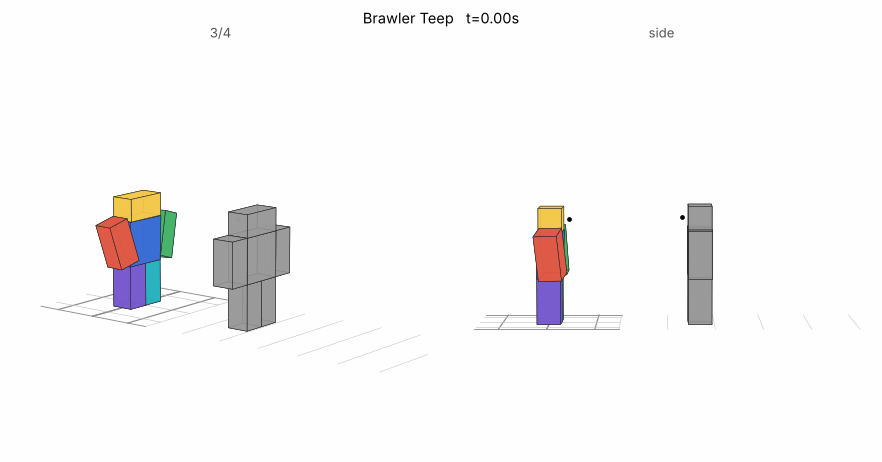
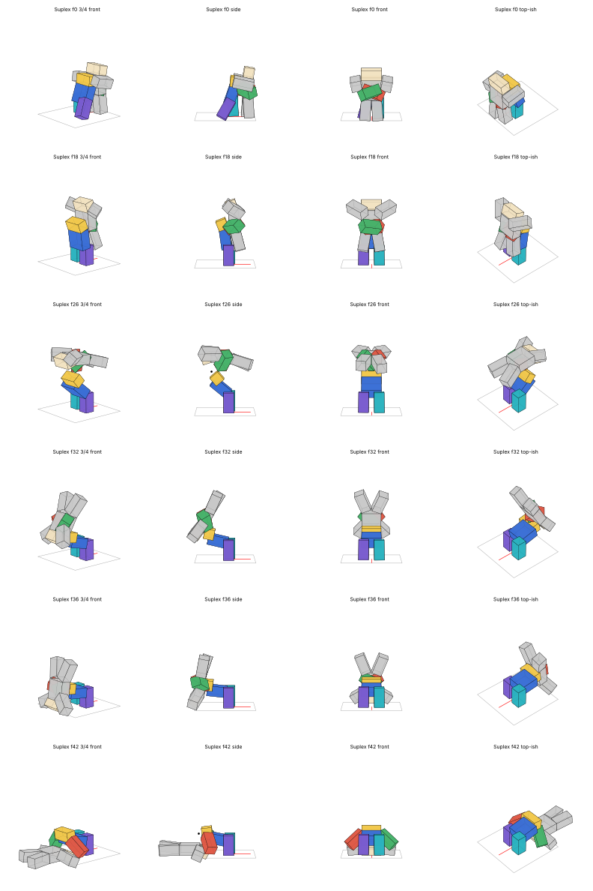
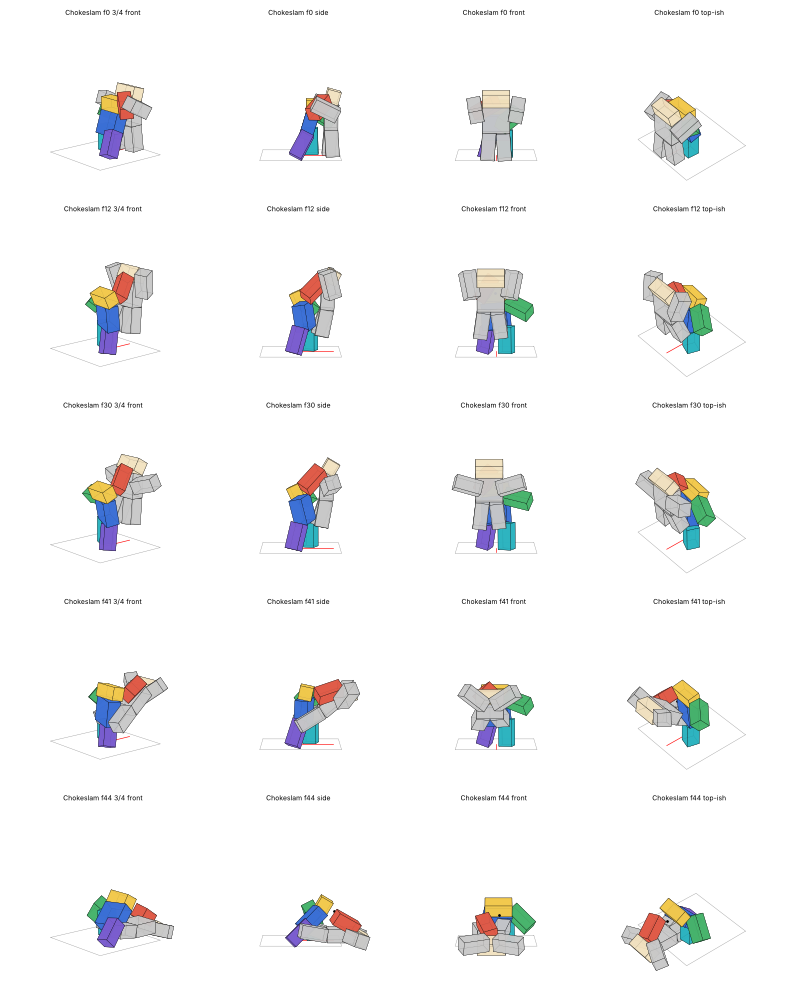
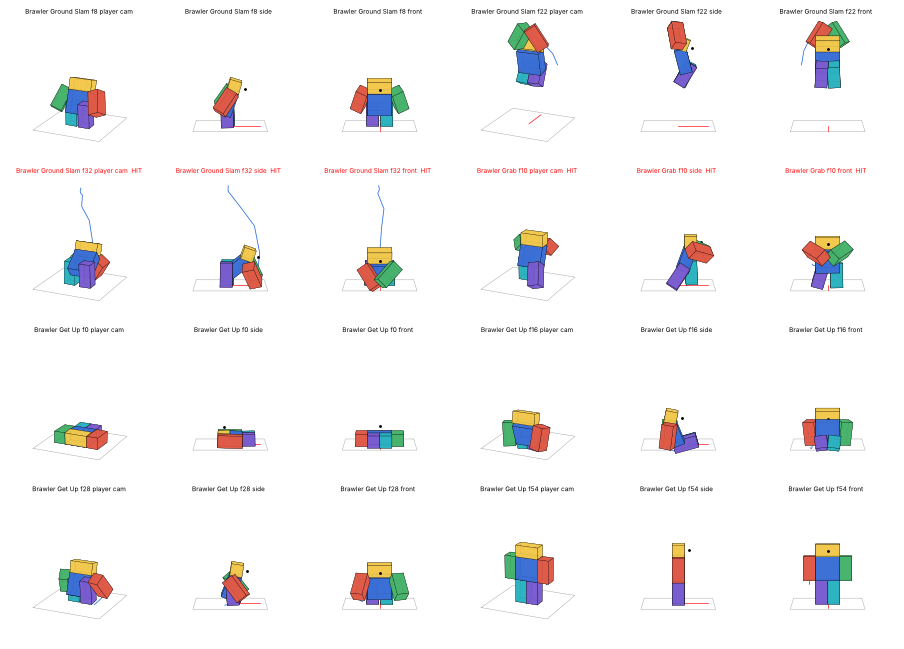
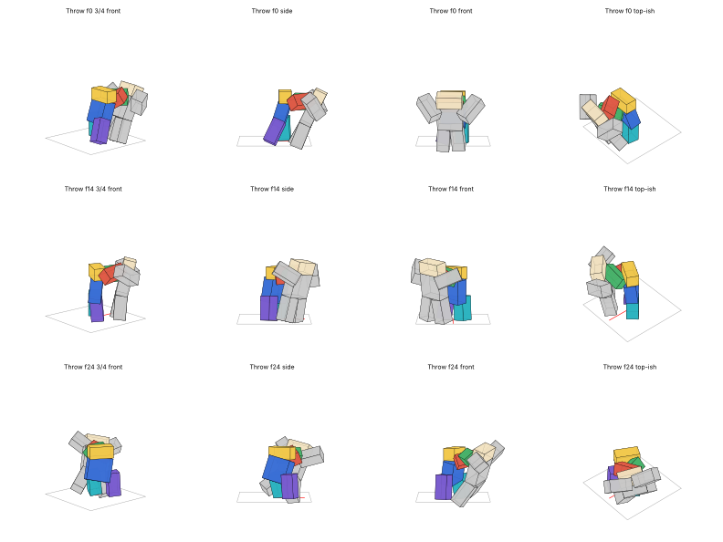

# Brawler: punches, kicks, slams and grabs

Basic fighting moves as a Roblox kit, with animations, effects and scripts: punches, kicks, a ground slam, and grabs with the throws and slams that follow them. It's built for the same **parry-style fight** as the other kits, so every move has an answer:
- **strikes** can be blocked or parried;
- the **teep** breaks a block outright, so parry it or get out of the way;
- the **axe kick** and **slam** come down from above (block them facing any way; you can't parry them);
- **grabs beat blocks**. You beat a grab by hitting first, rolling through it, or not being there.

| Move | What it does | Damage | How to answer it |
|---|---|---|---|
| **Haymaker** | A wide right hook thrown from the back foot. He winds right with the fist drawn back by his ear, then steps in and swings it round flat at head height and on across his body. Knocks them flying. | 14 | Block or parry it. The wind-up is the tell. |
| **Uppercut** | Dropped low and wound right, then up off the back foot, the fist driven up through the chin and on over his head. **Launches** them. | 10 | Block or parry. |
| **Roundhouse** | A spinning right roundhouse at head height. The right knee chambers, he pivots on the planted left foot, the torso leans away, and the leg whips round flat through the target. Wide: it sweeps them off to his left. | 12 | Block or parry. |
| **Axe Kick** | The right leg swung straight up past his face, a hang at the top, then the heel chopped down into a deep lunge. Takes 70 of a guard's 100. | 15 | **Never parryable.** Block it facing any way (that costs most of your guard), or step out of reach. |
| **Teep** | A heavy push kick off the back leg. A long wind-up: he leans far back with the right side turned away and the arm cocked, the knee pulled up to the chest and held. Then the hips whip round and drive through, and the foot is shoved straight out into their middle as he throws his weight back behind it and slams the rear arm down. The foot stamps down after. A bigger impact and camera shake than the other strikes, and it shoves them straight back, hard. | 13 | **Breaks a block outright** (a guard-break stun). Parry it instead, or step out of reach. |
| **Ground Slam** | A crouch, a 2.6-stud hop with both fists locked overhead and the knees tucked, then both fists hammered into the floor as he lands. Launches everyone within 11 studs. | 12 | From above: block facing any way, never parry. |
| **Grab & Throw** | A lunging two-handed grab. Caught by the collar, they're hauled up onto their toes. He winds, steps through, swings them round and hurls them away. | 9 | Grabs beat blocks. Hit him in the wind-up, roll through it, or don't be in front of him. |
| **Suplex** | Grabbed round the waist. He drops under them, stands up lifting them off their feet, arches back into a bridge and spikes them head-first into the floor behind him. They flop over flat on their back, then **get back up**. | 18 | As above. |
| **Chokeslam** | Caught by the throat and lifted clean off the floor one-handed, held up high while they kick. Then he slams them flat on their back in front of him and follows them down into a crouch. They get back up. | 20 | As above. |

**In the ability place:** press **M** and pick the **Striker** preset (Haymaker, Uppercut, Roundhouse, Axe Kick) or the **Grappler** preset (Grab & Throw, Suplex, Chokeslam, Ground Slam) or the **Kickboxer** preset (Teep, Roundhouse, Axe Kick, Haymaker), or mix any four. Each move turns you to where the camera looks.

**Without the Loadout menu**, the keys are:

| Key | Move |
|---|---|
| Z | Haymaker |
| X | Uppercut |
| C | Roundhouse |
| V | Axe Kick |
| E | Teep |
| B | Ground Slam |
| T | Grab & Throw |
| G | Suplex |
| H | Chokeslam |





## The grabs

A grab is two people animated together, and that's done properly:
1. **The victim's body** follows a path authored in the grabber's space.
2. **The grabber's hands are solved onto it on every frame**, so they really hold the waist, the throat or the collar through the whole throw.
3. **The victim's side** is its own animation: hands pushing at his shoulders or clawing at the hand on their throat, legs kicking, flung out on the impact, then limp.
4. **Getting up:** slammed down, they lie flat for a beat and then get up (**Brawler Get Up**: sit up pushing off the floor, feet under, stand).

How the game moves them:
- **The server:** when a grab connects, it anchors both of them. The grabber stays where he stands, and the victim is placed at the start of the path.
- **Every client:** carries the victim along the path, frame by frame from the shared clock, and plays their side of the throw on them. So the same throw plays on every screen, for NPCs too.
- **Letting go:** the server lets them go where the path ends, standing upright. The get-up animation lies them down, so there's no physics to fight.
- **Cut short:** if the grabber is hit or dies mid-throw, the victim is dropped at once where they are, upright, with a moment to find their feet. If the victim dies, they're let go.
- **The rules:** you can't grab someone who's already held, or start a move while holding someone.





## The animations

They're in the style of your reference animations (the fist M1s and the abilities rig), built the same way as Leorio's:
- **The rhythm:** a counter-move, the coil, a loaded slow-in, a 3–5 frame whip, then overshoot, settle and drift.
- **The legs:** done the way your ice downslam does them. The feet are planted and solved on every frame, so they never slide during a turn. The support leg stands upright, the back leg stretches out long on the big hits, and the head stays on the target.
- **The kicks** were checked against your leg sweep and leg axe. A kicking leg is aimed out from its hip at full length (at head height for the roundhouse, straight up for the axe kick, straight ahead at stomach height for the teep), and it's allowed to cross the standing leg in the air. Planted feet are still never allowed to cross.
- **The build checks every frame:** planted feet stay 0.9 studs apart side to side, one leg stays within 25° of upright whenever both feet are down, and no leg slides more than 1.6 studs off its hip.

| Clip | Length | Hit |
|---|---|---|
| `Brawler Haymaker` | 0.9s | 22/60 |
| `Brawler Uppercut` | 0.8s | 16/60 |
| `Brawler Roundhouse` | 0.85s | 17/60 |
| `Brawler Axe Kick` | 1.0s | 30/60 |
| `Brawler Teep` | 1.23s | 31/60 |
| `Brawler Ground Slam` | 1.2s | 32/60 |
| `Brawler Grab` | 0.7s | 10/60 (the hands close; a whiff plays on as a stumble and recovery) |
| `Brawler Suplex` / `Held Suplex` | 1.2s | 36/60 (let go at 42) |
| `Brawler Chokeslam` / `Held Chokeslam` | 1.3s | 44/60 (let go at 50) |
| `Brawler Throw` / `Held Throw` | 0.9s / 0.5s | let go at 26/60 |
| `Brawler Get Up` | 0.9s | |





## The effects

They're from your combat effects pack (`VFX/CombatVFX`), so they're realistic: moving air, smoke and dust, with no cartoon flashes. I added three effects to the pack for this kit, and they're available to everything else too:

| Effect | When |
|---|---|
| `FistSwing` | Every punch: a streak behind the punching fist, with air pulled along behind it and a push of air at the fastest point. |
| `KickSwing` (new) | Every kick: a wider streak behind the kicking foot only (the standing leg is left alone). A `KickPush` burst of air fires at the fastest point of each swing of the leg, so the axe kick gets one on the way up and one on the chop. |
| `HeavyHit` | The haymaker and axe kick landing, and on a body as it's slammed down. |
| `M1Final` | The uppercut, roundhouse and throw landing. |
| `M1Hit` | Anything blocked. |
| `GroundSlam` | The ground slam, at his fists. |
| `BodySlam` (new) | A body hitting the floor (the suplex, the chokeslam): air blasted out flat, a low ring of smoke and dust, pebbles, a few cracks, and dust that hangs. |

The camera shakes on your hits and harder on the slams. The sounds are your game's own, re-pitched (in `Brawler › Sounds`):
- `Swing` (Slash);
- `Punch` and `Heavy` (RockHit);
- `Slam` (GroundHit);
- `Grab` (PaperHit).

With the **hit sounds** (`Audio/HitSounds`) in ReplicatedStorage and their ids filled in, punches and kicks play `FistHit` and heavy hits play `FistHeavy` instead, a different take every time. See [Hit sounds](../../Audio/HitSounds/README.md).

Set `Config.Color` to tint the wind for a coloured style.

The kick trails are tested on your real kicks: the effects pack's swing test now plays every frame of the roundhouse and axe kick, and checks that only the kicking foot trails and that a push lands at the hit.

## Files

- **`../Jajanken/Jajanken.rbxl`**: the ability place has it, with the other kits, the parry system, the ability menu and the training dummies (grab and throw the dummies and the bandits). The Brawler's animation rig stands in the training yard.
- **`Brawler.rbxm`**: the kit for your own game. It's one folder of labelled folders, each named for where its contents go:

  | Folder in the kit | Put it in |
  |---|---|
  | `1. Put the Brawler folder in ReplicatedStorage` | `Brawler` (Config, GrabPaths, Animations, Sounds, Remote) → **ReplicatedStorage** |
  | `2. Put BrawlerServer in ServerScriptService` | `BrawlerServer` → **ServerScriptService** |
  | `3. Put BrawlerClient in StarterPlayer - StarterPlayerScripts` | `BrawlerClient` → **StarterPlayer › StarterPlayerScripts** |
  | `4. Put CombatVFX in ReplicatedStorage` | the combat effects pack (skip it if you already have it; this one has the new kick and body slam effects) |
  | `5. Recommended - the parry system (Combat)` | `Combat` → ReplicatedStorage, `CombatServer` → ServerScriptService, `CombatClient` → StarterPlayerScripts |
  | `6. Optional - the ability menu (Loadout)` | `Loadout` → ReplicatedStorage, `LoadoutServer` → ServerScriptService, `LoadoutClient` → StarterPlayerScripts |
  | `7. Optional - Workspace` | the animation rig, for publishing the animations |

  Without the parry system the moves still work (plain damage and knockback), but nothing can be blocked or parried. Your game needs **R6** avatars.

Unpublished animations only play in Studio. To publish them:
1. Open **Brawler Animation Rig** in the Animation Editor.
2. Publish all 13 clips, the held victims' and the get-up included.
3. Paste the ids into `Brawler › Config › Config.Animations`.

## Settings (`Brawler › Config`)

Each move has its own table:
- `HitDelay` (the animation's Hit marker: the build checks it);
- `Damage`, `Stun` and `StunKind`;
- `Knockback` and `Lift`;
- `GuardDamage` and `FromAbove`;
- the hit `Box` in front of him, or the slam's `Radius`;
- the step-in `Lunge`;
- `Recovery` and `Cooldown`.

The grabs share `Config.Grab`:
- `At` (when the hands close);
- the reach's `Box` and `Lunge`;
- `WhiffRecovery`;
- `Lead` (a beat before the throw starts, so every client starts it together);
- `GetUp`.

Also: `SharedCooldown` (0.4s), `MoveWalkSpeed` (6, while a strike plays out), `TurnToCamera`, `HitPlayers`, `TeamCheck` and `Color`.

## How it works

The server owns:
- cooldowns, timing and hit boxes;
- whether a grab connects, holding both of them, and letting go;
- the damage, through `Combat.resolve` when the place has the parry system.

A grab connecting is a zero-damage hit with the `Grabbed` stun, which can't be blocked or parried. That's how it beats blocks and cancels whatever the victim was doing. The slam is a `Knockdown` stun lasting until they're back on their feet. The parry system plays no reaction for those two: the kit animates them.

Your client plays your own moves at once: you turn to the camera, then the animation, the step in, the swing trail and the whoosh. It asks the server with `Cast`. Everything else comes from the server's broadcasts, timed to `workspace:GetServerTimeNow()`.

The throws' paths are generated with the animations (`generate_brawler.py` writes them into `Brawler.GrabPaths`), so the body always matches the hands.

Other server scripts can react to hits:

```lua
game.ServerScriptService.BrawlerServer:WaitForChild("OnHit").Event:Connect(function(attacker, victim, ability, damage, outcome)
end)
```

## Rebuilding and tests

`generate_brawler.py` builds `build/Brawler.rbxmx`, `build/BrawlerRig.rbxmx` and the labelled kit `Brawler.rbxmx`, and writes `tests/grab_paths.luau`. `../Jajanken/build.sh` builds it with everything else.

Tests (`luaurun`, from this folder):
- `tests/server.luau`, 78 checks:
  - every strike's timing, damage, stun, knockback and walk speed;
  - blocks and parries, the teep breaking a block (and still parryable), the axe kick from above, and the slam all round;
  - the grabs: beating a block, holding both still, the start of the path, the slam on the path's clock, the knockdown lasting through the get-up, letting go where the path ends (upright), and the grabber freed at the end of his clip;
  - the throw's hurl along the swing;
  - whiffs, rolling through a grab, being cut short, the victim dying, one grab at a time, the loadout and bad input.
- `tests/client.luau`, 57 checks:
  - turning to the camera, the animations, the step in, and the fist and kick trails;
  - the slam and the hit effects, and the camera shake;
  - your own suplex: both sides played, the victim carried along the path frame by frame, the body slam, letting go and the get-up;
  - being thrown yourself, and no moves while held;
  - being cut short, and other players' moves.

**Not checked:** the build and the tests are headless, so how it looks in motion in Studio hasn't been seen yet. That includes the trails, the grab with network lag, and the victim's camera during a throw. Tell me what to change.
