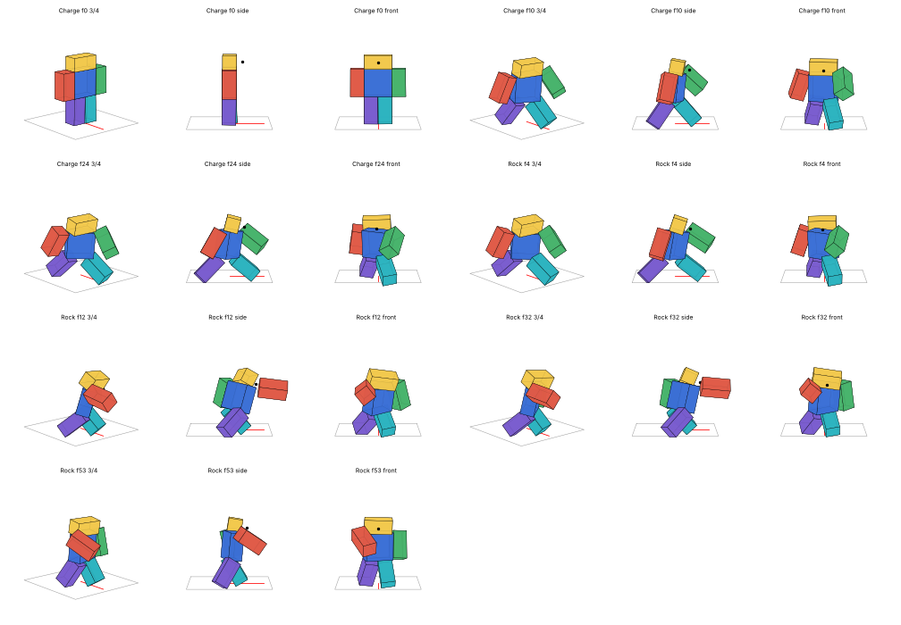
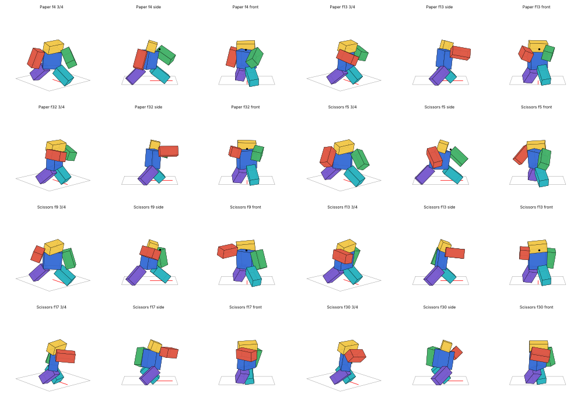

# Jajanken: Gon Freecss's Hatsu

Gon's Jajanken from Hunter x Hunter as a working Roblox ability, with animations, effects and scripts. To cast, hold a key to gather aura into the fist, then let go:

| Key | Mode | What it does |
|---|---|---|
| **Z** | Rock (グー) | A lunging punch that sets off the aura in the fist. Close range, heavy, big knockback. |
| **X** | Paper (パー) | An open-palm thrust that throws the aura as a ball, which explodes on whatever it hits. Ranged, with blast damage. |
| **C** | Scissors (チー) | Two fingers become a blade of aura, swept flat across the front. Wide and fast. |

**Charging:** tap the key for a quick cast, or hold it for up to **3 seconds** for full power. Letting go at any point casts it, and at full charge it casts by itself. Damage, knockback, hitbox size, the ball's speed, range and blast, and the effects all scale with how long you held it. While you hold, Gon chants "Saisho wa guu… Jan… Ken…" over a charge bar, then shouts GUU! / PAA! / CHII! on release.

Gamepad uses X / Y / B. Touch devices get on-screen buttons.

## Files

- **`Jajanken.rbxl`**: a ready-to-play place. Open it in Studio and press **Play**. It contains:
  - everything already in the right services;
  - an R6 test ground with four dummies, which stand back up after 3s, and three pillars to throw Paper at;
  - damage numbers;
  - the animation rig.
- **`Jajanken.rbxm`**: the same ability as a kit for your own game. It's one folder of labelled folders, each named for where its contents go:

  | Folder in the kit | Put it in |
  |---|---|
  | `1. Put the Jajanken folder in ReplicatedStorage` | `Jajanken` (Config, JajankenVFX + effects + sounds, Animations, Remote) → **ReplicatedStorage** |
  | `2. Put JajankenServer in ServerScriptService` | `JajankenServer` → **ServerScriptService** |
  | `3. Put JajankenClient in StarterPlayer - StarterPlayerScripts` | `JajankenClient` → **StarterPlayer › StarterPlayerScripts** |
  | `4. Optional - Workspace` | the animation rig (for publishing) and a test dummy |

  The kit also has a `READ ME` script with the same instructions. Your game needs **R6** avatars (Game Settings › Avatar).

### Before a live game: publish the animations

The animations are KeyframeSequences, and unpublished animations only play in Studio. To publish them:
1. Open **Jajanken Animation Rig** in the Animation Editor.
2. Load each of `Jajanken Charge`, `Hold`, `Rock`, `Paper` and `Scissors` and publish it.
3. Paste the ids into `Jajanken › Config › Config.Animations`.

The client registers the KeyframeSequences itself while you test in Studio. It warns once if it can't.

## Settings (`Jajanken › Config`)

Everything is a `{ tapped, fully charged }` pair, so a value in between is used for a part charge.

| | Rock | Paper | Scissors |
|---|---|---|---|
| Damage | 12 → 45 | 10 → 38 (direct). The blast falls off to half at its edge. | 9 → 32 |
| Knockback (studs/s) | 35 → 95 | 25 → 80 | 15 → 40 |
| Reach | box 5×5×6 → 9×8×10 in front | flies at 75 → 120 studs/s, out to 70 → 140 studs, blast radius 7 → 15 | box 10×5×7 → 16×6×12, wide |
| Cooldown | 4s | 5s | 3.5s |

Global settings:
- `MaxCharge` (3s).
- `ChargeWalkSpeed`: 4 while charging and casting; set it to 0 to root Gon in the stance.
- `CanJumpWhileCharging`.
- `SharedCooldown`: 0.8s between any two casts.
- `HitPlayers` and `TeamCheck`.
- Paper's `AimWithCamera`: it's thrown where the camera looks, within 70° of the facing.
- The keys.
- `Chant`.

Each `HitDelay` is the time from the release to the hit. It must match the animation's `Hit` marker (Rock 0.2s, Paper and Scissors 13/60s), and the generator checks that it does.

## How it works

The server owns everything that matters:
- **Charge:** measured from when the server hears the key go down to when it hears it come up, so a client can't fake a full charge.
- **At 3s:** the server casts it by itself.
- **Checks and hits:** it checks cooldowns, runs the hitboxes and the Paper ball (spherecast every frame), and deals the damage and knockback.

The client asks with `Charge` and `Release`, plays the animations, and draws:
- **Your own charge:** your aura and charge bar show the instant you press.
- **Everyone else's:** other players' charges, casts, hits and the ball come from the server's broadcasts.
- **Timing:** they're timed with `workspace:GetServerTimeNow()`, so the ball flies along the server's line on every screen.

Other server scripts can react to hits, for stun, combos, quests and so on:

```lua
game.ServerScriptService.JajankenServer:WaitForChild("OnHit").Event:Connect(function(attacker, victim, mode, damage, charge)
end)
```

Knockback is a short `LinearVelocity` on the victim's HumanoidRootPart. That pushes players too, not just NPCs, because it replicates to whoever owns their physics.

## Animations (R6, 60 fps, legs keyed)




| Clip | Length | What it is |
|---|---|---|
| `Jajanken Charge` | 0.4s | Drops into Gon's stance: a deep lunge, left foot forward, body side-on, right fist drawn back past the hip, left hand reaching low at the target. |
| `Jajanken Hold` | 1s loop | The stance breathing, with the drawn fist trembling as the aura builds. |
| `Jajanken Rock` | 0.9s | The hips drive, and the right fist rips straight out from the hip at chest height with the body lunging behind it. **Hit** at 0.2s. |
| `Jajanken Paper` | 0.85s | The right hand comes up from the hip into an open-palm thrust. The ball leaves the palm on **Hit** (0.217s). |
| `Jajanken Scissors` | 0.85s | The two-finger blade sweeps flat from out on the right round to the left. **Hit** (0.217s) is as it crosses the front. |

**How they're built:**
- **Releases:** every release starts on the exact stance pose, so it cuts in from the hold at any frame.
- **Legs:** planted: each leg is swung just far enough for its foot to land on the floor.
- **Arms:** aimed from the shoulder, so a rigid R6 arm never pokes out above it.
- **Smoothing:** the same as the M1s, with angular jerk cut 2.0–3.1×.

The rig's AnimSaves also has a **full-cast preview** per mode (charge → 1s hold → release) to watch in the Animation Editor.

## Effects

They're built from your game's own emitters (`nen.rbxm`):
- **Jajanken:** the RockRA fist fire, PaperProjectile orb and ScissorsSlash crescents, plus the RockHit, PaperHit and ScissorsCast sounds.
- **The nen auras:** Ken and Ren.
- **The realistic wind pack:** for the physical side.

The aura is gold-orange nen, in the game's Jajanken orange. The hits are the nen going off, with the physical side done the realistic way: wind, pressure rings, smoke, dust, rocks and cracks. There are no star bursts, flash frames or black contrast frames.

| Effect | When | What |
|---|---|---|
| `Aura` | while charging, on the body | Nen rising off the body, a swirl of aura and smoke at the feet and dust blown out across the floor. Power lines come in at 35% charge, a second layer at 70%, and pebbles lift off the floor at 45%. It thickens and brightens with the charge. |
| `RockCharge` / `PaperCharge` / `ScissorsCharge` | while charging, at the fist | The RockRA fire round a white core, a ball of aura forming in the palm, or a blade of aura streaming off the fingers. Each grows with the charge. |
| `Release` | on letting go | The aura flares off the body, and a ring of air and dust is pushed out across the floor. |
| `RockBlast` | Rock's hit, at the fist | The nen detonates forward. Wind bursts, a spinning gust, pressure rings and streaks blast out, with a cone of smoke that hangs. On the floor: wind, a wall of dust, rocks (30%+) and cracks (60%+). |
| `PaperBall` | in flight | The PaperProjectile orb, trailing air streaks and thin smoke. |
| `PaperBlast` | where the ball bursts | The nen goes off in every direction, with wind, rings, streaks and smoke. On the floor: dust, rocks and a scorch at 50%+. |
| `ScissorsSlash` | Scissors' hit | Your ScissorsSlash crescents and wind arcs lying flat across the front, a wind crescent and air streaks. |
| `NenHit` | on each victim | A small burst of nen through them, a puff of air, a ring, streaks and dust. |

`JajankenVFX` plays them:
- `Play` is for bursts.
- `Attach` is for charging effects, with `:SetCharge(0..1)` and `:Stop()`.
- `Projectile` is for the ball.
- `Sound` plays the sounds.

The emitter attributes are the same as in CombatVFX, plus `MinCharge`, `Grow` and `RateGrow` for charging.

The textures can't be downloaded here, so the effects were tuned from your emitters' settings, not by looking at them. Check them in Studio and tell me what to change. Every layer is one line in `effects.py`.
- The Scissors crescents keep the rotation they had in your ScissorsSlash. If the cut curves the wrong way, flip the `Rotation` on `Effects › ScissorsSlash`'s Slash layers.

## Files and rebuilding

- `anims.py`: the five animations, built with `Animations/animkit.py`.
- `effects.py`: the effects, built with `VFX/CombatVFX/generate_vfx.py`'s layer builder.
- `generate_jajanken.py`: puts it all together.
- `src/`: the scripts:
  - `Config.luau`
  - `JajankenVFX.luau`
  - `JajankenServer.server.luau`
  - `JajankenClient.client.luau`
  - the test area's `DummyRespawn` and `DamageNumbers`.
- `place.project.json` + `build.sh`: build the `.rbxl` with Rojo.

```bash
./build.sh path/to/ANIMSFORCLAUDE.rbxmx path/to/nen.rbxmx path/to/rbxconv   # rbxconv: any rbx-dom rbxmx -> rbxm converter
```

There are headless tests against Place1's mock engine (`luaurun`, see `Place1/README.md`). Run them from this folder:
- `luaurun tests/server.luau`, 45 checks:
  - tap, half and full charge damage;
  - the auto-cast at 3s;
  - cooldowns;
  - Rock's reach against Scissors' width;
  - the Paper ball hitting a dummy, a wall and its range, and its aim (including NaN aims);
  - death, bad input, teams and leaving.
- `luaurun tests/client.luau`, 62 checks:
  - the keys, the Studio animation registration and the animations played;
  - the aura building with the charge;
  - the bar and chant, release and auto-release;
  - every server event drawn with the real effect tree: other players' charges, the ball's flight, bursts, hits and denials;
  - dying mid-charge.
