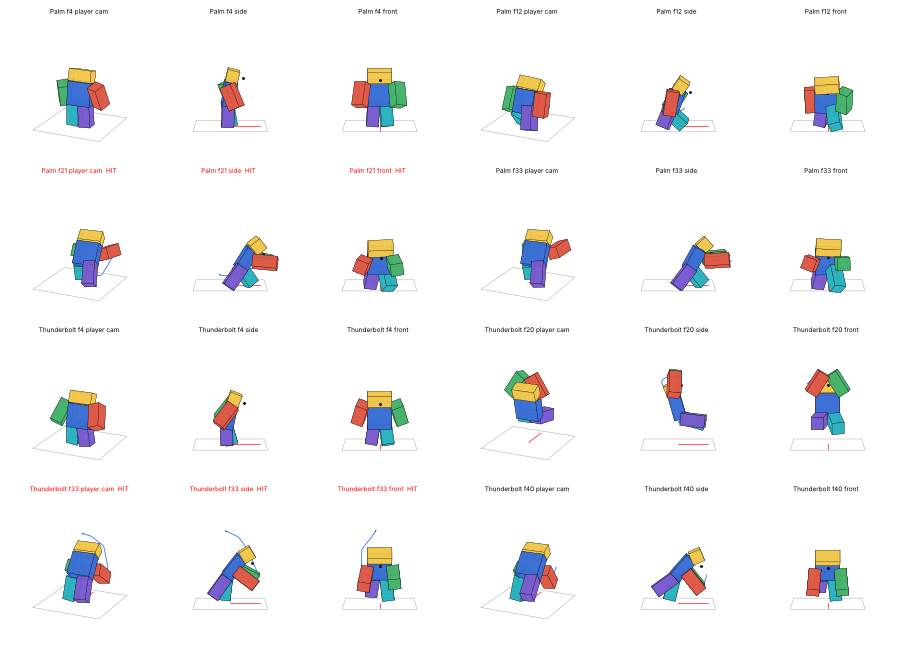
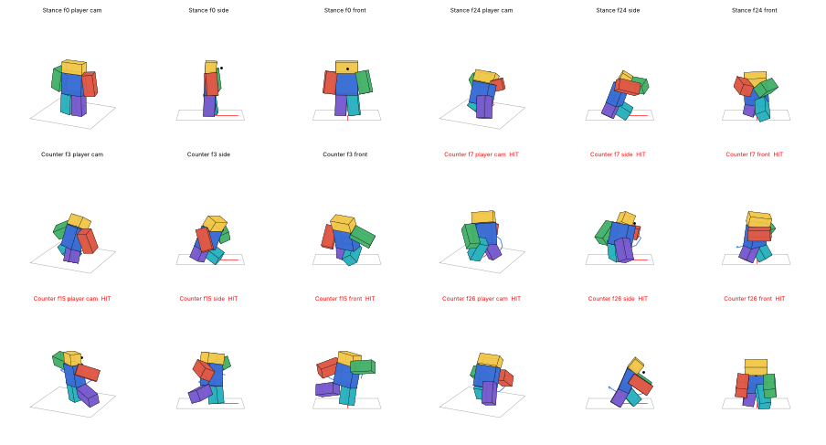
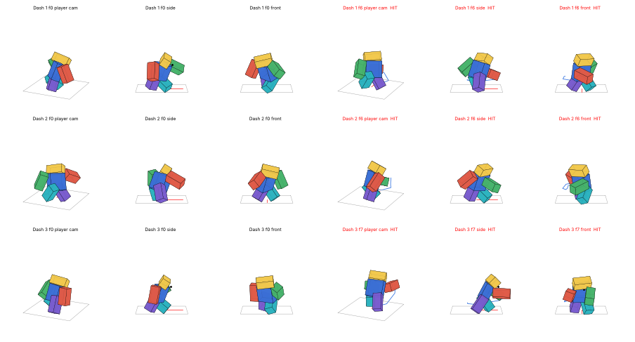

# Killua: Godspeed lightning

Killua Zoldyck's lightning from Hunter x Hunter as a Roblox ability kit, with animations, effects and scripts. It's built for a **parry-style fight**: every attack is telegraphed, and each one has a clear answer. The moves take their cue from Killua in Jump Force (the palm, Narukami, Shippu Jinrai and the Godspeed teleports), and the animations are in the same style as Gon's Jajanken, so the two kits sit side by side.

| Key | Ability | What it does | How to answer it |
|---|---|---|---|
| **Z** | Lightning Palm | As in the anime, he shocks you by putting his palms on you. He sinks into a low crouch with both hands drawn back by his hips and lightning arcing between them, blurs forward, and drives both palms flat into your chest. Then he holds them there while the shock surges through. It paralyses the target (a Shock stun, 1.1s). | **Parry** it (the crouch is the tell), or block it. |
| **X** | Thunderbolt (Narukami) | Killua leaps, gathers lightning between his hands at the top, and brings a bolt down where he aims. It locks on to whoever is near the aim line. A ring on the floor shows where it will land for the whole leap. | **Never parryable**: get out of the ring. Blocking works from any side, but takes 70 of the 100 guard. |
| **C** | Whirlwind (Shippu Jinrai) | A counter stance for 0.65s. If a hit lands on him in that window, he blinks behind the attacker and answers with a rising claw, a spinning heel kick and a double palm. None of those can be blocked or parried. | **Don't attack into it**: wait it out. If nothing comes, he's left open for 0.45s. Unblockable and uncounterable hits still go through. |
| **V** | Lightning Dash (Godspeed) | Up to **three teleports** in a row (press V again within 0.9s), each striking whoever he passes through or lands beside. He's untouchable for a moment in each one. With someone in front of him the chain zigzags: in front of them, through to behind, and back through. | **Parry** a strike, which ends the chain, or block. Turn to face him: a strike comes **from where he started the dash**, so the second dash hits a blocker from behind. |

Gamepad uses X / Y / B / R1, and touch devices get on-screen buttons. In the ability place the keys come from the hotbar instead (see [Loadout](../Loadout/README.md)): press **M** to choose which abilities sit on Z X C V.

## Files

- **`../Jajanken/Jajanken.rbxl`**: the ability place, with Gon's Jajanken and Killua together. Open it in Studio and press **Play**. It contains:
  - both kits;
  - the parry system ([Combat](../Combat/README.md)): **F** to block, tap F to parry;
  - the ability menu (**M**) and hotbar;
  - training dummies;
  - both animation rigs.

  You start as Killua; press M and pick the Gon preset to switch.
- **`Killua.rbxm`**: the kit for your own game. It's one folder of labelled folders, each named for where its contents go:

  | Folder in the kit | Put it in |
  |---|---|
  | `1. Put the Killua folder in ReplicatedStorage` | `Killua` (Config, KilluaVFX + effects + sounds, LightningBeams, Animations, Remote) → **ReplicatedStorage** |
  | `2. Put KilluaServer in ServerScriptService` | `KilluaServer` → **ServerScriptService** |
  | `3. Put KilluaClient in StarterPlayer - StarterPlayerScripts` | `KilluaClient` → **StarterPlayer › StarterPlayerScripts** |
  | `4. Optional - the parry system (Combat)` | `Combat` → ReplicatedStorage, `CombatServer` → ServerScriptService, `CombatClient` → StarterPlayerScripts |
  | `5. Optional - the ability menu (Loadout)` | `Loadout` → ReplicatedStorage, `LoadoutServer` → ServerScriptService, `LoadoutClient` → StarterPlayerScripts |
  | `6. Optional - Workspace` | the animation rig, for publishing the animations |

  The parry system is optional but recommended. Without it, the abilities still work (plain damage and knockback), but nothing can be blocked or parried and Whirlwind has nothing to counter. The kit has a `READ ME` script with the same instructions. Your game needs **R6** avatars.

### Before a live game: publish the animations

Unpublished animations only play in Studio. To publish them:
1. Open **Killua Animation Rig** in the Animation Editor.
2. Publish each of `Killua Palm`, `Thunderbolt`, `Land`, `Stance`, `Counter`, `Dash 1`, `Dash 2` and `Dash 3`.
3. Paste the ids into `Killua › Config › Config.Animations`.

Do the same for the parry system's reactions (see [Combat](../Combat/README.md)).

## The lightning: Lightning Beams

The bolts are drawn with **[Lightning Beams](https://github.com/SamyBlue/Lightning-Beams)** by Quasiduck (SamyBlue): the open-source lightning module that a lot of Roblox games use ([DevForum thread](https://devforum.roblox.com/t/843534)). It's MIT-licensed, and its license travels with it in `Killua › LightningBeams › LICENSE`. The kit has v1.1 (commit 406c3b9):
- `LightningBolt`: the bolts.
- `LightningSparks`: sparks thrown off them. This is the pre-v1.1 sub-module, patched to work with v1.1; see the `[Killua kit patch]` comments.
- EtiTheSpirit's `PartCache`, which the module uses to recycle bolt parts.

`KilluaVFX` wraps it:

| Function | What it draws |
|---|---|
| `Bolt(from, to, options)` | One bolt between two points or Attachments. It follows Attachments as they move. |
| `Strike(from, to, options)` | A bolt with branches forking off it. Used for the palm and Narukami. |
| `Crawl(model, seconds, options)` | Short arcs jumping between points on a body. Used for the stance, the palm's wind-up, and anyone shocked. |
| `Ghost(model, cframe, seconds)` | A pale afterimage left behind by a teleport. |

If `LightningBeams` is missing, the bolts are skipped and everything else still works.

## Settings (`Killua › Config`)

| | Lightning Palm | Thunderbolt | Whirlwind | Lightning Dash |
|---|---|---|---|---|
| Damage | 14 | 22 | 5 + 7 + 11 | 6 + 6 + 12 |
| Stun | Shock 1.1s | Shock 0.7s | 0.55, 0.55, Shock 1.0 | 0.45, 0.45, Shock 0.8 |
| Guard damage | 35 | 70 | can't be blocked | 20 each |
| Parryable | yes | **no** | no (counter flurry) | yes (ends the chain) |
| Reach | box 5 × 5.5 × 9.5 in front, after a 7-stud lunge | lands up to 18 studs away, radius 9 | blinks 3.2 studs behind an attacker up to 20 studs away | 18 studs per dash; 3.5 studs either side of the path, 4.5 round the landing |
| Busy for | 0.75s | 0.95s | 0.65s window + 0.45s if it whiffs | 0.3s per dash |
| Cooldown | 7s | 10s | 9s | 8s, from the end of the chain |

Global settings:
- `SharedCooldown`: 0.5s between any two abilities.
- `HitPlayers` and `TeamCheck`.
- The keys and gamepad buttons, used when the place has no Loadout menu.
- `MobileButtons`.
- `LightningColor`.

Each hit's timing is the animation's `Hit` marker:
- Palm: 21/60s.
- Thunderbolt: 33/60s.
- The counter: 7, 15 and 26/60s.
- The dashes: 6, 6 and 7/60s.

The generator checks that Config matches the markers and fails the build if they drift apart.

## How it works

The server owns everything that matters: cooldowns, timing, targets, hit boxes and damage. Every hit goes through `Combat.resolve` when the place has the parry system. The server also tells the parry system when each attack will land (`Combat.announce`), which the training dummies and any AI can use.

The client plays your own casts at once:
- the animation;
- the palm's lunge;
- Narukami's leap, hang and fall;
- the dash teleports;
- the lightning.

It asks the server with `Cast` / `Dash`, and draws everyone else's casts from the server's broadcasts, timed with `workspace:GetServerTimeNow()`.

**Lightning Dash** moves the client at once, so it feels instant. The server then checks each dash before it counts:
- how far it went (18 studs, plus 6 of slack for lag);
- that nothing solid is in the way;
- that it's the next dash in the chain, inside the chain window.

A dash that fails the check is sent back to where it started (`DashDenied`).

A stun (being hit, parried or guard-broken) cuts whatever Killua is doing short. A dash chain that's cut short still goes on cooldown.

Other server scripts can react to hits:

```lua
game.ServerScriptService.KilluaServer:WaitForChild("OnHit").Event:Connect(function(attacker, victim, ability, damage, outcome)
end)
```

## Animations (R6, 60 fps)

Killua moves like the assassin he is: low and loose, hands open like claws, and everything starts and stops dead. The reference rhythm runs every strike, as in Jajanken:
1. a counter-move;
2. the coil;
3. a loaded slow-in;
4. a 3–4 frame whip;
5. overshoot and settle;
6. a slow drift on the held pose.

| Clip | Length | What it is |
|---|---|---|
| `Killua Palm` | 1.0s | Lightning Palm: he sinks into his low, hunched crouch with both hands drawn back by his hips. Then he lunges and drives both palms flat into the chest, square on, leaning his whole weight in (**Hit** at 0.35s). The palms stay on the target, arms locked and shaking as the shock surges through, before he eases off, still low. |
| `Killua Thunderbolt` | 0.95s | A crouch, the leap, and both hands gathered overhead at the top. Then both palms slam down at the target as the bolt drops. **Hit** at 0.55s. It ends falling, legs reaching for the floor. |
| `Killua Land` | 0.4s | The landing after Narukami, played when the feet touch down. |
| `Killua Stance` | 1.1s | Whirlwind: dropped into a low ready stance, hands loose, swaying, for the counter window. Then up again if nothing came. |
| `Killua Counter` | 0.9s | After the blink behind the attacker: a rising claw, a spinning heel kick and a double palm. **Hits** at 7, 15 and 26/60s. |
| `Killua Dash 1 / 2 / 3` | 0.45 / 0.45 / 0.6s | Arriving low out of the teleport and striking at once: a right claw, a left claw back the other way, then a lunging double palm. **Hits** at 6, 6 and 7/60s. |

Every clip keys the legs: these are committed attacks, so the walk doesn't drive them. The legs follow your reference ability animations (ice downslam, leg sweep):
- **Turning with the body:** the feet are placed relative to the hips, not pinned to the floor. When the torso whips round, the stance pivots with it.
- **No crossing:** each foot stays in its own lane under its own hip, so the legs never cross. A low stance is faked the way the reference does it, by sliding the legs up into the hips.
- **Checked:** the build fails if any frame brings the feet closer than 0.9 studs side to side (the reference never goes under 0.96).

Key poses:





## Effects

The lightning itself is Lightning Beams. Everything around it is built from your game's own emitters (`nen.rbxm`), the same way as Jajanken's:
- the BigBang and Crazy Slots sparks;
- the Ken aura's energy layers;
- the realistic wind pack, for air rings, dust, rocks, cracks and scorch.

The lightning is white at the core and pale electric blue round it, going deeper blue at the edges. Soft glows stand in for flash frames.

It's turned up hard:
- **Bolts:** every bolt has a wide, see-through deep-blue halo round its core, so it glows.
- **Light:** strikes throw a flash of cold light on everything round them.
- **Narukami:** three bolts come down from the sky one after another, with branches forking off.
- **Arcs:** arcs crawl densely over Killua through every move, and some leap off him into the air. Anyone paralysed crackles with them.
- **Emitters:** every lightning layer (sparks, glows, discharges, static) is turned up by `BOOST` in `effects.py`: 1.8× the sparks, 1.6× the brightness, 1.2× the size and 2× the lights. Turn that down if it's too much.

| Effect | When | What |
|---|---|---|
| `Crackle` | Whirlwind's stance | Static over the body. |
| `HandCharge` | Lightning Palm's wind-up, in both hands | Lightning gathering in the palms, growing to the hit, with bolts arcing between them. |
| `PalmBurst` | the palms' hit | The lightning going off out of the palms, with bolts forking on through the target and more surging out of the palms for a moment after. |
| `ShockHit` | on each victim | A burst of sparks through them. Shocked victims also get arcs crawling over them for as long as they're paralysed. |
| `StrikeMarker` | through Narukami's leap | The warning ring on the floor where the bolt will land. |
| `ThunderStrike` | where Narukami lands | The bolt's impact: sparks, an air ring, dust, rocks, cracks and a scorch mark. |
| `DashBurst` | both ends of every dash | Sparks, air streaks and dust. The client also leaves an afterimage where he was. |
| `Blink` | where Whirlwind's counter reappears | Sparks, a discharge and static. |

The sounds are your game's own (ScissorsCast, RockHit, GroundHit, Slash and PaperHit), re-pitched and renamed: `Crackle`, `PalmHit`, `Thunder`, `Dash` and `Zap`. Swap in real electric sounds any time in `KilluaVFX › Sounds`.

As with Jajanken, the textures couldn't be viewed here, so the effects were tuned from your emitters' settings. Check them in Studio and tell me what to change: every layer is one line in `effects.py`.

## Files and rebuilding

- `anims.py`: the animations, built with `Animations/animkit.py` and the Jajanken solvers.
- `effects.py`: the effects, built with Jajanken's effect builder.
- `LightningBeams/`: the vendored module (see above).
- `generate_killua.py`: puts it all together into `build/Killua.rbxmx`, `build/KilluaRig.rbxmx` and the labelled kit `Killua.rbxmx`.
- `src/`: the scripts:
  - `Config.luau`
  - `KilluaVFX.luau`
  - `KilluaServer.server.luau`
  - `KilluaClient.client.luau`

`../Jajanken/build.sh` builds everything (Combat, Loadout, Killua, Jajanken, the place and both kits):

```bash
../Jajanken/build.sh path/to/ANIMSFORCLAUDE.rbxmx path/to/nen.rbxmx path/to/rbxconv
```

There are headless tests against Place1's mock engine (`luaurun`, see `Place1/README.md`). Run them from this folder:
- `luaurun tests/server.luau`, 107 checks, with the parry system and the menu:
  - every ability's timing, damage, stun, reach and cooldown;
  - blocked, parried and guard-broken hits;
  - Narukami's lock-on, aim limits and floor drop;
  - Whirlwind's counter, whiff and evade;
  - the dash chain's rules, the server's dash checks, and the dash mixup;
  - interrupts, the loadout, bad input, teams and death.
- `luaurun tests/standalone.luau`, 10 checks: the same server without the parry system or the menu.
- `luaurun tests/client.luau`, 78 checks:
  - the keys through the hotbar;
  - the animations;
  - the palm's charge in both hands, its lunge and the flash on contact, and Narukami's leap, hang and landing;
  - the stance and the counter's blink;
  - the dash zigzag and its targeting;
  - the server's denials and stops;
  - other players' casts, drawn with the real effect tree.
- `luaurun tests/client_standalone.luau`, 34 checks:
  - the client's own keys and cooldown bar;
  - the real Lightning Beams module drawing bolts, sparks and arcs.
