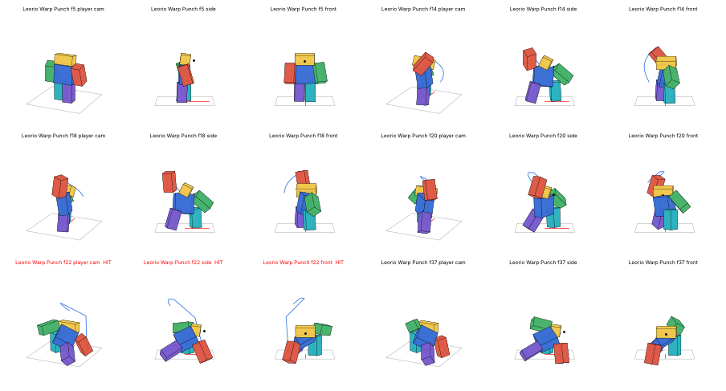
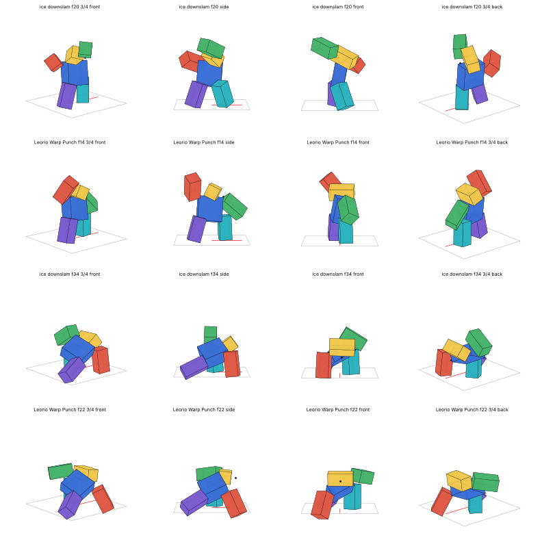
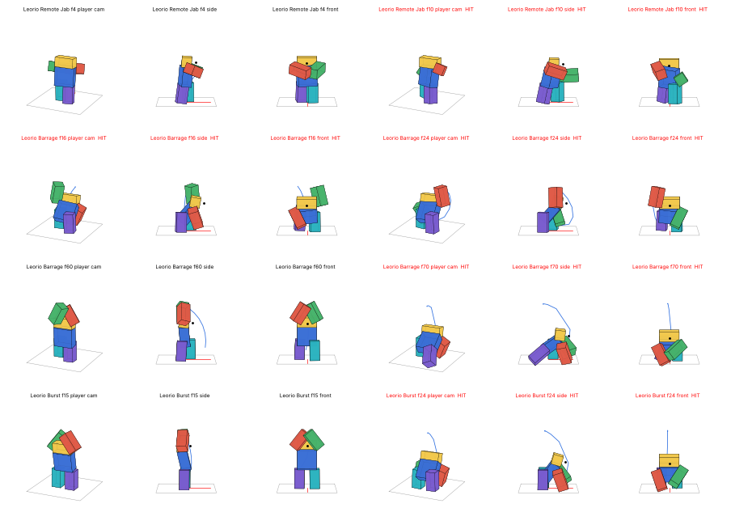

# Leorio: warp punches

Leorio Paladiknight's Hatsu from Hunter x Hunter as a Roblox ability kit, with animations, effects and scripts. He's an Emitter: he punches something near him, the floor or the air, into a warp hole, and the fist comes out of another hole by his target. That's how he lands his punch on Ging at the election, without moving from his spot. Like the Killua and Jajanken kits, it's built for a **parry-style fight**: every warp is telegraphed by its hole, and each move has a clear answer.

| Key | Ability | What it does | How to answer it |
|---|---|---|---|
| **Z** | Warp Punch | The punch he throws at Ging. He rears back with the right fist cocked high, then drives it down into the floor. A hole opens beside his target's head the moment the fist goes in, and 0.25s later the fist comes out of it and slugs them (16 damage, knocked away from the hole). | The hole is the tell. **Face it** to block or **parry** it: the blow comes *from the hole*, not from him. It opens 60° round from him, so a blocker who faces him is covered. Or step out of the way: the hole stays where it opened. |
| **X** | Remote Jab | A snapped left jab into a little hole at his knuckles. The fist comes out of a hole **behind** the target and pulls them toward him (7 damage, 0.7s stun). It sets up Warp Punch: a jab, then a Warp Punch, lands as a combo. | Comes from behind: a block facing him won't stop it. **Turn round** to face the hole, which opens the moment he jabs, 0.4s before the fist. |
| **C** | Warp Barrage | Down low, hammering the floor with alternating fists. Each punch comes out of a new hole round the target, **from a different side every time**, and the holes follow the target as they're knocked about. The last one is a double-handed hammer down on them **from a hole overhead**. 6 hits, 25 damage in all, and the target is kept stunned the whole way through. | Don't get caught by the first one: the rest are a true combo. The first comes from his right side. The hammer from above can be blocked facing any way, but never parried. |
| **V** | Portal Burst | Both fists slammed into the floor between his feet. Six holes open in a ring round him and fists come **up** out of them, launching everyone within 9.5 studs (10 damage, a Launch stun). His get-off-me move. | Never parryable. Blocking works facing any way. Or don't be standing next to him when he raises both fists. |

You aim with the camera: he turns to where it looks and locks on to whoever is nearest that line (within 30°). With nobody there, the hole opens 14 studs out along the look.

Gamepad uses X / Y / B / R1, and touch devices get on-screen buttons. In the ability place the keys come from the hotbar instead (see [Loadout](../Loadout/README.md)): press **M** and pick the **Leorio** preset.



## The animations

Leorio is a big, open brawler, not a technician: every move is a wide, heavy, committed swing with his whole weight behind it. The reference rhythm runs every strike, as in the Jajanken and Killua sets:
1. a counter-move;
2. the coil (the torso winds the wrong way, the fist chambers);
3. a loaded slow-in;
4. a 3–5 frame whip;
5. overshoot and settle;
6. a slow drift on the held pose.

**Warp Punch is built on your ice downslam.** The wind-up and the slam use the poses I measured from it:
- the wind-up turns the torso 90° right;
- the slam whips it 150° back round, plunging and rolling until the right shoulder dives at the floor;
- the feet land on the same spots as the reference's.

Here they are side by side, the reference above and Leorio below each time:



**The legs, done the way the reference does them.** At the slam, your ice downslam's lead leg stands almost straight up (5°) and slides 1.3 studs up *into the pitched, rolled torso*. Only the back leg is aimed from the hip and stretched out long (65°). The leg solver from Killua's kit aimed every leg from its hip, which can't make that pose. So there's a new one (`Shared/stance.py`):
- **Feet:** they are planted on the floor and solved on every frame of the baked animation. They stay exactly where they're put however far the torso whips round between keys, with no foot sliding mid-whip.
- **Lead (support) leg:** it stands upright and slides in the torso's space, as the reference's does.
- **Back leg:** it's aimed from its hip and stretched.
- **The head:** it's solved per frame too, kept level and on the target while the torso dives under it. The reference's head also stays on its mark through the slam.

The build still checks every frame of every clip: the feet never come within 0.9 studs of each other side to side, and with both feet down one leg is always within 25° of upright.

| Clip | Length | What it is |
|---|---|---|
| `Leorio Warp Punch` | 1.2s | A counter-move, the wind-up (right fist cocked high, left hand pointing down at the spot), then the fist driven down into the floor (**Hit** at 22/60s). He stays down on it, arm buried, while the fist travels. When it lands out of the hole (**Warp** at 37/60s), a jolt kicks back up his arm. |
| `Leorio Remote Jab` | 0.7s | A snapped left jab with a step in (**Hit** at 10/60s, the fist into the hole at his knuckles). The arm stays locked in the hole until the fist lands behind the target (**Warp** at 24/60s), then snaps back to his guard. The right fist stays up by his chin throughout. |
| `Leorio Barrage` | 1.6s | Dropped into a wide, low crouch, pounding the floor with alternating fists like pistons (**Hits** at 16, 24, 32, 40 and 48/60s). The striking side's shoulder dives each time while the torso rocks over planted feet. Then he rears up with both fists locked overhead and brings them down in one double-handed hammer (**Hit** at 70/60s). |
| `Leorio Burst` | 1.0s | A dip, then he rises tall with both fists locked overhead, leaning back into it. Then he drops into a deep, square squat and slams both fists into the floor in front of his feet (**Hit** at 24/60s). |



The generator checks that the server's timings in `Config` land on the animations' `Hit` and `Warp` markers, and fails the build if they drift apart.

## The effects

Leorio's aura is the game's own nen teal (the Ken aura's `85ffe7`): white at the core, deep sea-green at the edges. The effects are built from your nen pack's emitters, the same way the Jajanken and Killua effects are.

**A warp hole** (`LeorioVFX.Portal`) is built from parts plus emitters:
- **The hole:** a dark disc.
- **The rim:** a ring of 18 bright segments turning round it, over a softer neon glow.
- **The surface:** a ForceField shimmer across it.
- **The emitters:** the Ken aura's **energy swirl** turning across it and its **water-surface ripple** spreading over it, with Disrupt's black shockwave darkening it. Wisps curl off the rim and specks of aura are drawn in.
- **Opening and closing:** it opens with a slight overshoot and shrinks away when it closes.

**The fist** (`LeorioVFX.Fist`) is his fist and forearm punching out of the hole: in his dark suit sleeve and white shirt cuff, with his own skin colour (taken from the caster's arm), and glowing faintly with his aura. It's 1.5× an R6 arm, so it reads from a distance. The arm only ever exists in front of the hole: its back end stays in the hole's plane, so it really comes *out of* it.

| Effect | When |
|---|---|
| `FistCharge` | The aura gathering in the fist during the wind-up. It swells as the punch nears. |
| `GroundPunch` | The fist going into the floor (into a small hole under it): the aura ripples out flat, with a ring of air and dust, grit and a few cracks. |
| `Trace` | The faint aura trail running along the floor from his fist to the target, the fist travelling through the warp. |
| `Portal` | The swirl and ripple across a hole. |
| `PortalBurst` | The fist coming through: an expanding ring of aura, a burst of energy, a pressure ring and air streaks. |
| `WarpHit` / `WarpHeavy` | On the victim, done the realistic way like the rest of the game's hits: air blasted through them (wind bursts, pressure rings, streaks), dust and, for the heavy ones, a spinning gust and a cone of smoke. |
| `BurstRing` | Portal Burst on the floor all round him: an aura ripple, a ring of air, a wall of dust, rocks and cracks. |
| `Aura` | Teal nen rising off him while he pounds the floor. |

The camera gives a small shake when you throw one and a bigger one when you're hit. The sounds are your game's own, re-pitched (in `Leorio › LeorioVFX › Sounds`):
- `Charge` (ScissorsCast);
- `Warp` (Slash);
- `Slam` (GroundHit);
- `Punch` and `Hit` (RockHit).

## Files

- **`../Jajanken/Jajanken.rbxl`**: the ability place has it, with the other kits, the parry system, the ability menu and the training dummies. The Parrying Dummy turns to face a warp hole, not Leorio. Leorio's animation rig stands in the training yard.
- **`Leorio.rbxm`**: the kit for your own game. It's one folder of labelled folders, each named for where its contents go:

  | Folder in the kit | Put it in |
  |---|---|
  | `1. Put the Leorio folder in ReplicatedStorage` | `Leorio` (Config, LeorioVFX + effects + sounds, Animations, Remote) → **ReplicatedStorage** |
  | `2. Put LeorioServer in ServerScriptService` | `LeorioServer` → **ServerScriptService** |
  | `3. Put LeorioClient in StarterPlayer - StarterPlayerScripts` | `LeorioClient` → **StarterPlayer › StarterPlayerScripts** |
  | `4. Optional - the parry system (Combat)` | `Combat` → ReplicatedStorage, `CombatServer` → ServerScriptService, `CombatClient` → StarterPlayerScripts |
  | `5. Optional - the ability menu (Loadout)` | `Loadout` → ReplicatedStorage, `LoadoutServer` → ServerScriptService, `LoadoutClient` → StarterPlayerScripts |
  | `6. Optional - Workspace` | the animation rig, for publishing the animations |

  The parry system is optional but recommended: without it the abilities still work (plain damage and knockback), but nothing can be blocked or parried. Your game needs **R6** avatars.

Unpublished animations only play in Studio. To publish them:
1. Open **Leorio Animation Rig** in the Animation Editor.
2. Publish the four clips.
3. Paste the ids into `Leorio › Config › Config.Animations`.

## Settings (`Leorio › Config`)

| | Warp Punch | Remote Jab | Warp Barrage | Portal Burst |
|---|---|---|---|---|
| Damage | 16 | 7 | 3 × 5 + 10 | 10 |
| Stun | 1.0s | 0.7s | 0.6s each, 0.8, 1.0 | Launch 1.0s |
| Guard damage | 55 | 20 | 12 each | 45 |
| Parryable | yes, facing the hole | yes, facing the hole | yes, facing each hole; the hammer from above never | **no** |
| Range | 50 | 45 | 40 | everyone within 9.5 studs |
| The hole | beside the head, 60° round from him, 3.6 studs off | behind the target, 3.2 studs off | round the target at a new angle each punch; the last 7 studs overhead | a ring of 6, 6.5 studs round him |
| Hole opens → fist | 0.25s | 0.4s (opens at the cast) | 0.12s | 0.12s |
| Busy for | 1.0s | 0.5s | 1.6s | 0.9s |
| Cooldown | 8s | 5s | 12s | 10s |

Also:
- `Targeting`: `AimWithCamera`, `Angle` (30°) and `Fallback` (14 studs).
- `Fist`: its `Scale`, `SleeveColor`, `CuffColor`, and whether to take `SkinFromCaster`.
- `SharedCooldown`, `HitPlayers`, `TeamCheck`, the keys and gamepad buttons (used when the place has no Loadout menu), and `MobileButtons`.

## How it works

The server owns everything that matters:
- cooldowns, timing and targets;
- **where each hole opens**;
- the hit boxes (a box in front of each hole, along its look);
- the damage, through `Combat.resolve` when the place has the parry system.

Every warped blow's `From` is its hole, so blocks and parries face the hole. The server also announces each one to the parry system with where it lands and where it comes from (`Combat.announce` has a new, optional `from` argument). The training dummies use that.

Your client plays your own cast at once: you turn to the camera, the animation starts and the aura gathers in the fist. It asks the server with `Cast`. The holes and fists arrive from the server for everyone alike, timed to `workspace:GetServerTimeNow()`. A stun or death cuts Leorio's cast short: every open hole of his closes and no fist comes out.

Other server scripts can react to hits:

```lua
game.ServerScriptService.LeorioServer:WaitForChild("OnHit").Event:Connect(function(attacker, victim, ability, damage, outcome)
end)
```

## Rebuilding and tests

`generate_leorio.py` builds `build/Leorio.rbxmx`, `build/LeorioRig.rbxmx` and the labelled kit `Leorio.rbxmx`. `../Jajanken/build.sh` builds it with everything else.

Tests (`luaurun`, from this folder):
- `tests/server.luau`, 65 checks:
  - where each hole opens (beside, behind, round and over the target) and when its blow lands;
  - blocks and parries that face the hole, and ones that don't;
  - dodging by stepping out of a hole's way;
  - Remote Jab into Warp Punch as a combo;
  - the barrage chasing its target round and keeping them stunned;
  - Portal Burst's ring and launch;
  - interrupts, the loadout, bad input and death.
- `tests/client.luau`, 74 checks:
  - turning to the camera, the animations and the aura in the fist;
  - each hole opening on time, square to its look, and closing;
  - the fist punching out along the hole's look and pulling back;
  - the trace, the ground punch and the burst ring;
  - the hits and the camera shake;
  - `Stop` closing everything, and other players' casts.

**Not checked:** the build and the tests are headless, so how the holes and fists look in Studio (the ForceField shimmer, the Highlight glow, the emitters' sizes) hasn't been seen yet. Tell me what to change.

Sources for how his Hatsu works: [Critical Hits](https://criticalhits.com.br/anime/hunter-x-hunter-como-funciona-o-nen-de-leorio/) and [Fanlore](https://fanlore.org/wiki/Leorio_Paladiknight).
