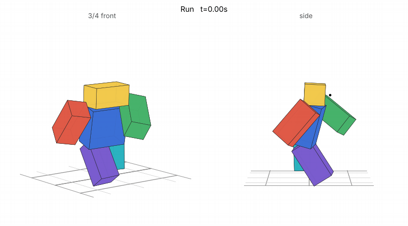
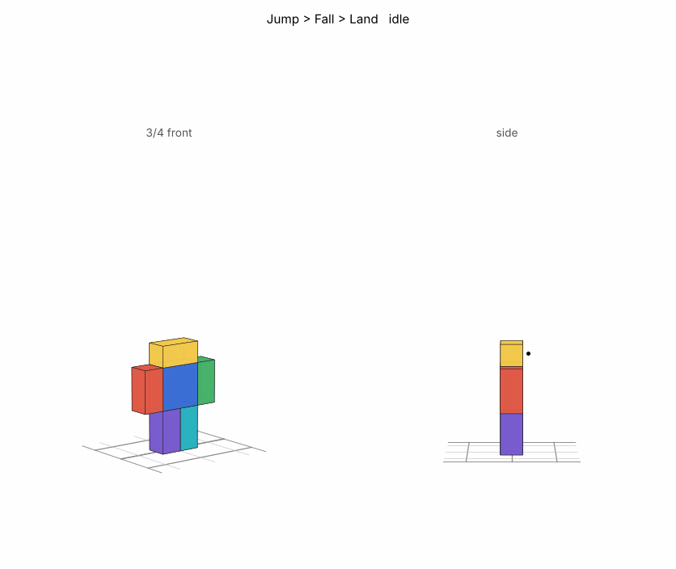

# Movement: sprinting, rolling, jumping and landing

| Input | What it does |
|---|---|
| Hold **Left Ctrl**, or **double-tap W** and keep holding it | **Sprint** at 26 (walking is 16) |
| **Q** | **Roll** forward the way you're moving (or facing if you're standing still), about 11 studs |
| **Space** | Roblox's own **jump**, with the kit's jump, fall and landing animations |

Gamepad: click the left stick to toggle sprinting, **L2** to roll. Touch devices get **Sprint** (a toggle) and **Roll** buttons.

**Sprinting:**
- **The animation:** a new run (see [The run](#the-run)). It plays at the speed you're really going, so the feet stay planted. The camera widens a little while you sprint, and stays wide through a jump.
- **Dust:** anyone running fast along the floor kicks up the effects pack's `RunDust`, whether they're sprinting or knocked back, and everyone sees it on everyone.
- **Getting along with the rest:** sprinting only ever swaps your walk speed between 16 and 26. Anything else that sets it wins while it lasts: swinging an M1, charging Jajanken, blocking, a stun. You're back to sprinting the moment it ends, if you're still holding the key.

**Rolling:**
- **The dodge:** the first 0.3s of the roll is untouchable. Hits pass through you as `Evaded`, the same as in the middle of a Lightning Dash.
- **Commitment:** you can't attack or block until the roll is over (0.5s).
- **Limits:** one roll a second, and not while you're stunned or in the middle of an attack. Rolling out of a block lets go of it.
- **Movement:** the push is along the floor only, fast at first and easing off, so gravity still works and you can roll off a ledge.
- **Effects:** `DashBurst` as you go, a `DashTrail` behind you, and `Land` dust where you come up.

**Jumping and landing** follow the Humanoid's state:
- **Jump:** plays as you leave the floor.
- **Fall:** the fall pose takes over when the jump is done, or 0.2s after you walk off an edge.
- **Land:** as hard as the fall was.
  - Under 20 studs/s (a step down): no landing at all.
  - A normal jump (about 53 studs/s): the full landing standing still.
  - On the move: lighter (0.55) and quicker (1.5x), so you run straight out of it.
  - A long drop (60+ studs/s): `Land` dust where you come down.
- **Other states:** climbing, swimming or sitting mid-air stops the air poses, with no landing after.
- **Priority:** all three play at Movement priority. That's over the default Animate script, and under attacks, so an M1 thrown mid-air keeps the fall's legs.

## The run

A sprint built for the game's sprint speed:
- **The stride:** 0.5s with a step on each foot. Each foot is down for only 15% of it: a sprinter's short contacts and long flights.
- **Planted feet:** a planted foot slides back at exactly 26 studs/s, so it stays put on the floor.
- **The body:** it leans into the run 14-16°, sinks onto each planted foot and rises through each flight. It turns with the arms and rocks a little over the foot that's down.
- **The legs:** each one kicks up behind, folds and drives the knee up in front, reaches, and claws back down onto the floor. The knees bend by sliding the legs up into the hips, as in the reference animations.
- **The arms:** they swing against the legs, across the body in front and a touch out behind.
- **The head:** it stays level and looks straight down the line.

## Jump, fall and land

- **Jump:** it starts from the push, since Roblox launches the instant you press jump. He stretches out tall with the arms thrown up, then tucks the knees as he rises and opens out into the fall pose.
- **Fall:** a loop for long falls. The arms are out for balance, the right knee is up and the left leg trails, all drifting slowly.
- **Land:** the feet set down at hip width and he drops into a deep squat to soak it up, hips back over the heels and arms out in front. Then he stands back up.

## The roll

A new animation in the style of your references:
1. a dip;
2. a dive with the hands reaching for the floor;
3. tucked tight (knees to the chest, arms hugging the shins) as the body turns over, with the chin tucked;
4. the feet coming back down at hip width;
5. a rise out of the crouch.

The character is turned to face the way it rolls, so it only ever rolls forward.

## Files

- **`../Jajanken/Jajanken.rbxl`**: the ability place has it.
- **`Movement.rbxm`**: the kit for your own game. It's one folder of labelled folders, each named for where its contents go:

  | Folder in the kit | Put it in |
  |---|---|
  | `1. Put the Movement folder in ReplicatedStorage` | `Movement` (Config, Animations, Sounds, Remote) → **ReplicatedStorage** |
  | `2. Put MovementServer in ServerScriptService` | `MovementServer` → **ServerScriptService** |
  | `3. Put MovementClient in StarterPlayer - StarterPlayerScripts` | `MovementClient` → **StarterPlayer › StarterPlayerScripts** |
  | `4. Put CombatVFX in ReplicatedStorage` | the combat effects pack (skip it if you already have it) |
  | `5. Needed - the Combat folder` | `Combat` → ReplicatedStorage, `CombatServer` → ServerScriptService, `CombatClient` → StarterPlayerScripts. The roll's dodge goes through it. |
  | `6. Optional - Workspace` | the animation rig, for publishing the animations |

Unpublished animations only play in Studio. Publish them from **Movement Animation Rig** (`Run` goes in as `Sprint`, then `Roll`, `Jump`, `Fall` and `Land`) and paste the ids into `Movement › Config › Config.Animations`.

## Settings (`Movement › Config`)

| Setting | Default | |
|---|---|---|
| `WalkSpeed` / `SprintSpeed` | 16 / 26 | `WalkSpeed` must be your game's normal walk speed |
| `SprintKey`, `DoubleTapW`, `SprintButton` | Left Ctrl, on, L3 | |
| `SprintFOV` | 80 | |
| `RunAnimationSpeed` | 26 | the speed the run's feet are planted for. Leave it at 26 even if you change `SprintSpeed`: the run then plays faster or slower to match |
| `Air.FallDelay` | 0.2 | seconds off an edge before the fall pose |
| `Air.SoftLanding` / `Air.HardLanding` | 20 / 50 | studs/s falling: no landing below the first, the full landing from the second |
| `Air.MovingLandWeight` / `Air.MovingLandSpeed` | 0.55 / 1.5 | the landing when you land on the move |
| `Air.DustSpeed` | 60 | landing this fast kicks up dust |
| `Roll.Speed` / `Roll.Time` | 40 / 0.45 | about 11 studs in all |
| `Roll.Intangible` / `Roll.Busy` / `Roll.Cooldown` | 0.3 / 0.5 / 1.0 | |
| `DustSpeed` | 21 | how fast someone has to run for dust |

## How it works

Sprinting is the client's own business: it changes only the player's walk speed, which their client controls anyway. Jumping, falling and landing are too: animations played on your own character replicate, so everyone sees them.

A roll moves the character on the client, since the client owns its physics, and asks the server with `Roll`. The server:
- checks the cooldown, and that you're not stunned or busy;
- makes you untouchable and busy through `Combat`;
- tells everyone, so they see your roll's effects.

Tests (`luaurun`, from this folder):
- `tests/server.luau`, 16 checks: the dodge, being busy, the cooldown, the checks, rolling out of a block, and bad input.
- `tests/client.luau`, 51 checks:
  - sprinting from Ctrl, a double-tap and the toggle;
  - giving way to whatever else sets the walk speed, then coming back;
  - the run animation, played at the speed really gone;
  - the jump, the fall pose (after the jump, or a moment after walking off an edge), the landing as hard as the fall (none for a step down, lighter on the move, dust after a long drop), and the air poses stopping for a ladder;
  - the roll's direction, push, easing off, animation and effects;
  - its cooldown, not rolling while stunned or busy, and the server's word;
  - other players' rolls and everyone's dust.
