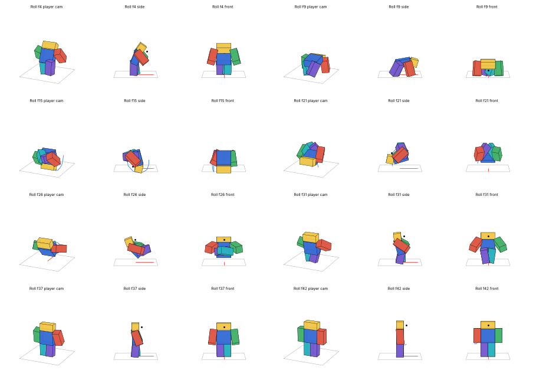

# Movement: sprinting and rolling

| Input | What it does |
|---|---|
| Hold **Left Ctrl**, or **double-tap W** and keep holding it | **Sprint** at 26 (walking is 16), with your own run animation |
| **Q** | **Roll** forward the way you're moving (or facing if you're standing still), about 11 studs |

Gamepad: click the left stick to toggle sprinting, **L2** to roll. Touch devices get **Sprint** (a toggle) and **Roll** buttons.

**Sprinting:**
- **The animation:** it's the run from your reference file (`ANIMSFORCLAUDE.rbxm`, the "normal player" rig's `new run`), used as it is and looped. The camera widens a little while you sprint.
- **Dust:** anyone running fast along the floor kicks up the effects pack's `RunDust`, whether they're sprinting or knocked back, and everyone sees it on everyone.
- **Getting along with the rest:** sprinting only ever swaps your walk speed between 16 and 26. Anything else that sets it wins while it lasts: swinging an M1, charging Jajanken, blocking, a stun. You're back to sprinting the moment it ends, if you're still holding the key.

**Rolling:**
- **The dodge:** the first 0.3s of the roll is untouchable. Hits pass through you as `Evaded`, the same as in the middle of a Lightning Dash.
- **Commitment:** you can't attack or block until the roll is over (0.5s).
- **Limits:** one roll a second, and not while you're stunned or in the middle of an attack. Rolling out of a block lets go of it.
- **Movement:** the push is along the floor only, fast at first and easing off, so gravity still works and you can roll off a ledge.
- **Effects:** `DashBurst` as you go, a `DashTrail` behind you, and `Land` dust where you come up.

## The roll

A new animation in the style of your references:
1. a dip;
2. a dive with the hands reaching for the floor;
3. tucked tight (knees to the chest, arms hugging the shins) as the body turns over, with the chin tucked;
4. the feet coming back down at hip width;
5. a rise out of the crouch.

The character is turned to face the way it rolls, so it only ever rolls forward.

## Files

- **`../Jajanken/Jajanken.rbxl`**: the ability place has it.
- **`Movement.rbxm`**: the kit for your own game. It's one folder of labelled folders, each named for where its contents go:

  | Folder in the kit | Put it in |
  |---|---|
  | `1. Put the Movement folder in ReplicatedStorage` | `Movement` (Config, Animations, Sounds, Remote) → **ReplicatedStorage** |
  | `2. Put MovementServer in ServerScriptService` | `MovementServer` → **ServerScriptService** |
  | `3. Put MovementClient in StarterPlayer - StarterPlayerScripts` | `MovementClient` → **StarterPlayer › StarterPlayerScripts** |
  | `4. Put CombatVFX in ReplicatedStorage` | the combat effects pack (skip it if you already have it) |
  | `5. Needed - the Combat folder` | `Combat` → ReplicatedStorage, `CombatServer` → ServerScriptService, `CombatClient` → StarterPlayerScripts. The roll's dodge goes through it. |
  | `6. Optional - Workspace` | the animation rig, for publishing `Sprint` and `Roll` |

Unpublished animations only play in Studio. Publish them from **Movement Animation Rig** and paste the ids into `Movement › Config › Config.Animations`.

## Settings (`Movement › Config`)

| Setting | Default | |
|---|---|---|
| `WalkSpeed` / `SprintSpeed` | 16 / 26 | `WalkSpeed` must be your game's normal walk speed |
| `SprintKey`, `DoubleTapW`, `SprintButton` | Left Ctrl, on, L3 | |
| `SprintFOV` | 80 | |
| `Roll.Speed` / `Roll.Time` | 40 / 0.45 | about 11 studs in all |
| `Roll.Intangible` / `Roll.Busy` / `Roll.Cooldown` | 0.3 / 0.5 / 1.0 | |
| `DustSpeed` | 21 | how fast someone has to run for dust |

## How it works

Sprinting is the client's own business: it changes only the player's walk speed, which their client controls anyway.

A roll moves the character on the client, since the client owns its physics, and asks the server with `Roll`. The server:
- checks the cooldown, and that you're not stunned or busy;
- makes you untouchable and busy through `Combat`;
- tells everyone, so they see your roll's effects.

Tests (`luaurun`, from this folder):
- `tests/server.luau`, 16 checks: the dodge, being busy, the cooldown, the checks, rolling out of a block, and bad input.
- `tests/client.luau`, 35 checks:
  - sprinting from Ctrl, a double-tap and the toggle;
  - giving way to whatever else sets the walk speed, then coming back;
  - the run animation;
  - the roll's direction, push, easing off, animation and effects;
  - its cooldown, not rolling while stunned or busy, and the server's word;
  - other players' rolls and everyone's dust.
