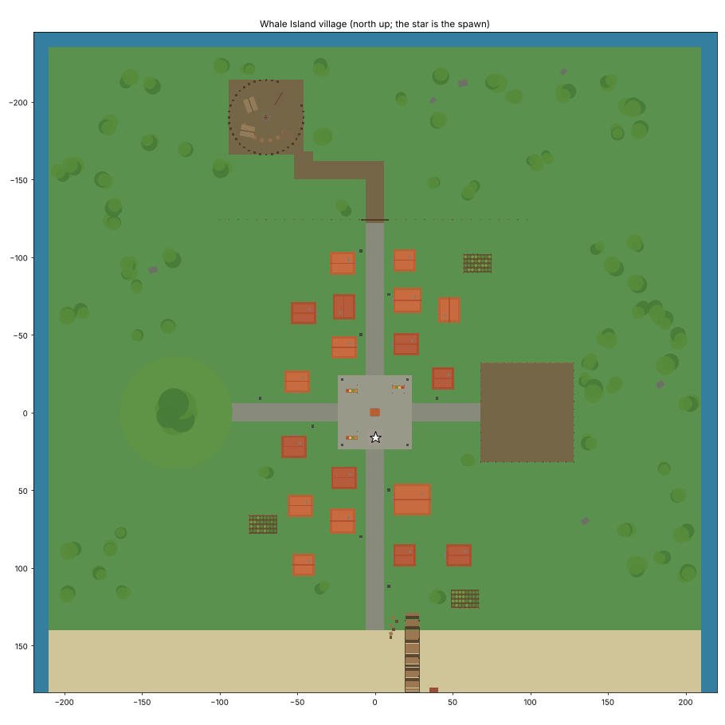
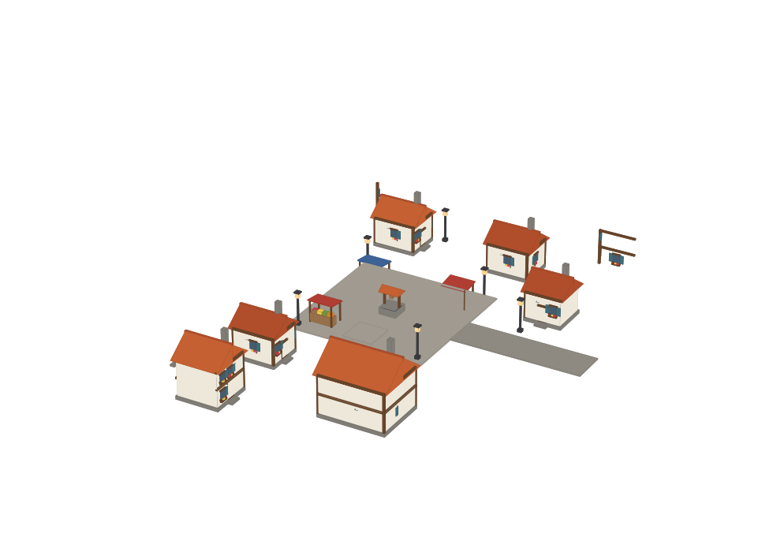

# Whale Island: the ability place's map

A small Hunter x Hunter style village after Whale Island, Gon's home. It's the map of `../Jajanken/Jajanken.rbxl`.

- **The plaza** (you spawn here): cobbles round an old well with a little tiled roof, market stalls under striped awnings, and lamp posts that light up the streets.
- **The houses:**
  - white plaster walls framed in dark timber on stone footings;
  - orange clay-tile gable roofs with chimneys;
  - shuttered windows with flower boxes;
  - a door with a step onto the street.

  Some are two storeys. **Mito's**, the tavern on the harbour road, has its sign out. Behind the streets there's a back row of houses and fenced vegetable gardens.
- **The harbour**: the road runs south down to a sandy beach that slopes into the sea, a long wooden pier on posts, a moored sailing boat, and crates and barrels.
- **The great tree** on its hill, west of the village.
- **The training yard**, east down the yard road: a fenced dirt yard with the training dummies (plain ones, plus the parry system's Blocking, Parrying and Sparring dummies) and the animation rigs (Gon's, Killua's, the M1s', and sprint/roll's) in a row along the north fence.
- **The bandit camp**: through the village gate (the "WHALE ISLAND" sign) and up the dirt path into the forest. It's a clearing behind a palisade of sharpened logs, with tents round a campfire, crates and a lookout, and five **bandits**.
- **The forest** all round, with rocks. Past the edge of the island the sea is walled off.

## The bandits

They wait round their campfire. Come within 45 studs and they come for you:
- **Fighting:** they run you down and throw M1 strings at you through the same stun system the players use (`MeleeServer`'s `NpcM1`), so their strings stun you the way yours stun them. They deal three quarters of a player's damage (`Melee › Config › NpcDamage`).
- **Defending:** you can block or parry them like anyone. They guard against some of your hits too, sometimes with a parry.
- **The leash:** lead them more than 90 studs from their camp and they give up, go back and heal by the fire.
- **Respawning:** a knocked-out bandit stands back up at the camp 10 seconds later.

Their clothes are the reference rig in a dark tunic and trousers, with a red bandana and a scarf over the face.

The camp is 220 studs from the spawn, far out of the bandits' reach. The settings are at the top of `src/BanditBrains.server.luau`.

## Files

- `generate_village.py` builds `build/Village.rbxmx`, the Workspace model with its scripts, and with `--preview` the two images above. As it builds, it checks the layout:
  - nothing overlaps (roads, houses, the yard, the camp, gardens, props);
  - everything is on the island;
  - the camp is well out of the bandits' reach of the spawn.

  `../Jajanken/build.sh` builds it last, after the other packages' animation rigs.
- `src/`, the map's scripts:
  - `BanditBrains`;
  - `DummyBrains`: the training dummies;
  - `DummyRespawn`: dummies stand back up 3 seconds after being knocked out;
  - `DamageNumbers`: what each hit did, floated over the victim.

Tests (`luaurun`, from this folder):
- `tests/bandits.luau`, 17 checks, against the real M1 string and stun system:
  - the bandits idling;
  - running you down;
  - a full string that keeps you stunned, for the NPC share of the damage;
  - being parried, and guarding some of your attacks;
  - giving up at the leash and healing;
  - respawning.
- `tests/dummies.luau`, 23 checks: the training dummies.

The village is built from parts only (no terrain), so it builds headless. Check how it looks in Studio and tell me what to change: every building is one line in `houses()`.
